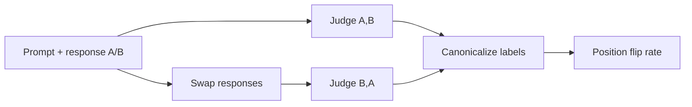

# Architecture

```mermaid
flowchart LR
  A[Prompt + response A/B] --> B[Judge A,B]
  A --> C[Swap responses]
  C --> D[Judge B,A]
  B --> E[Canonicalize labels]
  D --> E
  E --> F[Position flip rate]
```

Counterbalancing is done per pair rather than across aggregate batches, which makes individual instability inspectable and avoids composition effects.
